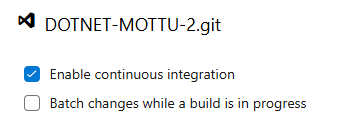

# MOTTU-DOTNET-DEVOPS
# Pipelines CI/CD

### Esse projeto tem como objetivo de utilizar Pipelines CI/CD no Azure é automatizar o processo de integração contínua (CI) e entrega contínua (CD) de seus aplicativos, garantindo que o ciclo de vida do desenvolvimento de software seja mais eficiente, confiável e escalável. O Azure DevOps oferece uma série de ferramentas para implementar esses pipelines, ajudando a otimizar a entrega de software e a reduzir erros humanos durante o desenvolvimento, testes e produção.


## Para sanar dúvidas nosso fluxo das Pipelines de CI/CD dentro do Portal Azure funciona da seguinte forma:
O sistema permite o gerenciamento de funcionalidades versionadas e rastreáveis dentro de um fluxo ágil, onde cada commit e pull request é vinculado a tasks criadas no Azure Boards, garantindo rastreabilidade e controle de mudanças. 

Ao submeter um pull request, o processo de integração contínua (CI) é automaticamente acionado via triggers, realizando o build da aplicação, a execução de testes automatizados e a criação dos recursos necessários no Azure, como o App Service, grupo de recursos e tabelas de banco de dados. 

Além disso, foi desenvolvido um script .sh executado via Git Bash, responsável por provisionar um banco de dados MySQL em nuvem. Esse script cria o grupo de recursos, realiza o build da imagem oficial do MySQL, publica a imagem no Azure Container Registry (ACR) e instancia o banco de dados para uso na aplicação. Lembrando que nosso app service para criar uma infra inicial utilizando na pipeline de CI, também está presente no Repos como um .sh, porém ele é executado dentro da pipeline de forma automática, sendo reponsável por conectar ao banco de dados e subir as tabelas também. 

Após o sucesso da pipeline de build, uma pipeline de entrega contínua (CD) é acionada automaticamente, utilizando o artefato gerado para implantar a versão mais recente da aplicação no ambiente de nuvem. 

---

### Projeto nas Organizações do Portal Azure:


```
    https://dev.azure.com/MOTTU-CICD/
    ou
    https://dev.azure.com/MOTTU-CICD/Sprint%204%20-%20Setup%20Azure%20for%20CI-CD
```

---

### Caso queira conferir os arquvios (.sh, .json., .cs) do projeto em .NET ASPNET CORE, deixo aqui o link para o repositório no GitHub:
[github.com/christianmilfont/DOTNET-MOTTU
](https://github.com/christianmilfont/DOTNET-MOTTU)

**(O REPOS DO AZURE NORMALMENTE ESTARÁ MAIS ATUALIZADO EM RELAÇÃO AOS ARQUIVOS DE DEVOPS, ACOMPANHE POR LÁ!)**

---

## Triggers adicionados




Os Triggers servem para disparar o Continuos Integration, dessa forma, toda vez que atualizarmos algo dentro do Repos, ao enviarmos um commit disparará a Pipeline de CI. Dessa maneira, posteriormente ao gerar o artefato CI, ele dispara o CD.

---


## Scripts de Infraestrutura no Azure

Este repositório contém dois scripts para configurar a infraestrutura no Azure: infra-banco.sh e infra-app.sh. O primeiro script configura o banco de dados MySQL usando o Azure Container Instances (ACI), e o segundo configura o ambiente de aplicação no Azure App Service.

### Requisitos:

- Azure CLI instalado e autenticado em sua conta Azure.

- Docker (opcional, para a importação de imagens no Azure Container Registry).

- Comando dos2unix para garantir que os scripts sejam executados corretamente em sistemas Unix/Linux.

- Cliente MySQL instalado na máquina local (para validar e criar o banco de dados).

### Estrutura dos Scripts
#### infra-banco.sh

Este script é responsável por:

- Criar um Resource Group no Azure para os recursos de banco de dados.

- Criar um Azure Container Registry (ACR).

- Importar uma imagem do MySQL para o ACR.

- Criar um Azure Container Instance (ACI) rodando o MySQL, com um banco de dados e usuário pré-configurados.

### Alterações Realizadas no infra-banco.sh:

O script não cria mais um App Service, já que isso foi movido para o script infra-app.sh.

A variável APP_NAME foi renomeada para DB_NAME, para refletir que esse script agora é focado na criação do banco de dados e não no aplicativo.

O banco de dados MySQL é configurado e disponibilizado via Azure Container Instances, sem a criação de recursos redundantes.

---

### infra-app.sh

Este script é responsável por:

- Criar um Resource Group no Azure, se necessário.

- Criar um App Service no Azure, com o runtime configurado para .NET 8 (ou qualquer outra stack configurada).

- Criar um Plano de Serviço de Aplicativo.

- Configurar o logging do App Service para garantir visibilidade de erros e acessos.

---

## Como Rodar os Scripts / Projeto
Lembrando que ao subir o script do banco, deverá alterar a string **DefaultConnection** (url do banco) de conexâo no appsettings dentro do projeto .NET do Repos:


---

Lembrar de alterar também o IP de conexão presente no arquivo **infra-app.sh**:


---

Caso seja necessário, adicione/altere as variaveis de ambiente dentro da **Pipeline de CI** ou de **CD**:


---

### Passo 1: Preparar o ambiente

Antes de rodar os scripts, é necessário garantir que você está com o ambiente correto:

Instalar a Azure CLI:
A Azure CLI é necessária para interagir com o Azure diretamente do terminal. Instalar Azure CLI

Instalar o cliente MySQL (se necessário):
Certifique-se de que o cliente MySQL está instalado para executar as validações do banco de dados localmente. Instalar MySQL Client

Instalar o dos2unix (se necessário):
Se você estiver usando um sistema Windows e os scripts forem criados no Windows, você pode ter problemas com os fins de linha. Para corrigir isso, use o comando dos2unix para converter os scripts para o formato Unix.


sudo apt-get install dos2unix  # Para sistemas Linux/Ubuntu
```bash
    dos2unix infra-banco.sh
    dos2unix infra-app.sh
```

**Nota: Este passo é necessário apenas se você estiver usando o script no Linux/Mac e ele foi criado no Windows.**


Verificar Docker (opcional):
Se você for usar o Azure Container Registry para importar a imagem do MySQL, o Docker deve estar instalado na máquina para fazer o az acr import. No entanto, não é necessário rodar o Docker localmente, pois o Azure gerencia o container.

Para verificar se o Docker está instalado:
```bash
    docker --version
```

**Se não tiver o Docker, você ainda pode executar os scripts sem problemas, desde que o Azure CLI esteja corretamente configurado.**

### Passo 2: Rodar os Scripts

Rodando o infra-banco.sh:

Este script cria a infraestrutura do banco de dados no Azure. Ele cria um banco MySQL usando o Azure Container Instance (ACI) e configura o banco de dados com os parâmetros que você especificar.

Para rodar o script, basta executar:
```bash
    bash infra-banco.sh
```

**Este comando irá:**

- Criar o Resource Group no Azure.

- Criar o Azure Container Registry (ACR).

- Importar a imagem do MySQL para o ACR.

- Criar um container MySQL no Azure Container Instance (ACI).

- Exibir o IP do banco de dados após o deploy.

**Certifique-se de que o Azure CLI está autenticado e você tem permissões suficientes para criar os recursos no Azure.**

---

### Rodando o infra-app.sh:

Este script configura o App Service no Azure para rodar a aplicação web. Ele cria o Resource Group, Plano de Serviço de Aplicativo e o App Service para rodar o aplicativo .NET.

Para rodar o script, basta executar:
```bash
bash infra-app.sh
```

**Este comando irá:**

- Criar o Resource Group no Azure (se não existir).

- Criar o Plano de Serviço de Aplicativo.

- Criar o App Service com a configuração do runtime (.NET 8).

- Configurar logs de aplicação no App Service.

**Como Funciona a Conexão entre o App e o Banco**

No infra-app.sh, quando o App Service for criado, você pode configurar a string de conexão do banco MySQL usando o IP do banco gerado pelo infra-banco.sh.

A variável DbHost no infra-app.sh deve ser configurada com o IP do container MySQL que foi criado (o IP é exibido ao final do script infra-banco.sh).

Exemplo de conexão no infra-app.sh:
```sql
DbHost="${DbHost:-<IP_DO_BANCO>}"
```

**Substitua <IP_DO_BANCO> pelo IP retornado pelo script infra-banco.sh.**

---

## Depuração e Logs
**caso for fazer testes no WorkBench MySQL**
- Configure assim.
- Lembre-se de colocar o nome do banco **criado pelo infra-banco.sh**, em Default Schema.


---

Para verificar os logs do container MySQL, você pode usar o comando:
```bash
az container logs --resource-group <RESOURCE_GROUP> --name <ACI_DB_NAME>
```

**Para visualizar logs do App Service (como erros ou acessos), você pode habilitar ou verificar os logs conforme descrito no infra-app.sh OU aplicar o Aplication Insights!**

## Conclusão

### Este projeto configura a infraestrutura necessária no Azure para rodar um banco de dados MySQL e uma aplicação web utilizando Azure Container Instances e Azure App Service. Certifique-se de que os requisitos estão atendidos antes de rodar os scripts, e use as variáveis de configuração para personalizar os recursos de acordo com suas necessidades.
